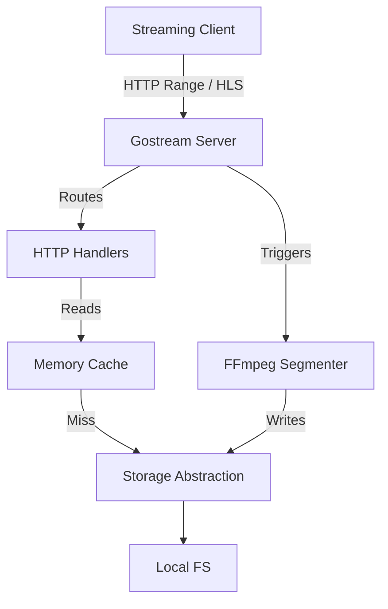

# Gostream

Gostream is a production-grade media streaming engine for Go. It enables developers to build high-performance video and audio streaming platforms with ease, supporting both raw file streaming (via HTTP Range requests) and HLS (HTTP Live Streaming).

## Features

- **Range-Based Streaming**: Efficient VOD streaming using `io.Copy` and `http.ServeContent`.
- **HLS Support**: Automatic video segmentation into `.ts` chunks and `.m3u8` playlist generation using FFmpeg.
- **Storage Abstraction**: Plug-and-play storage layer (Local Filesystem supported, S3-ready).
- **In-Memory Caching**: Fast access to frequently requested segments and playlists.
- **Zero Heavy Dependencies**: Built primarily on the Go standard library.
- **Concurrency**: Non-blocking background segmentation and thread-safe operations.

## Architecture



## Quick Start

### 1. Prerequisites

- **FFmpeg**: Must be installed and available in your `PATH`.

### 2. Basic Usage

```go
package main

import (
    "github.com/The-honoured1/gostream/server"
)

func main() {
    // 1. Initialize the Gostream engine
    srv := server.New()

    // 2. Register a video (this triggers HLS generation in the background)
    srv.RegisterVideo("my-video", "./path/to/video.mp4")

    // 3. Start the server
    srv.Start(":8080")
}
```

## API Endpoints

- `GET /video/{id}/stream`: VOD streaming with Range support.
- `GET /hls/{id}/playlist.m3u8`: HLS playlist for the specified video.
- `GET /hls/{id}/segment/{n}.ts`: Specific HLS media segment.

## Production Considerations

- **Concurrency**: The server uses a thread-safe registry for video metadata.
- **Caching**: The default implementation includes a TTL-based in-memory cache for HLS files.
- **Transcoding**: By default, Gostream uses `-codec: copy` for speed. If source videos are not web-compatible, you should adjust the `segmenter` options to support transcoding.

## License

MIT
